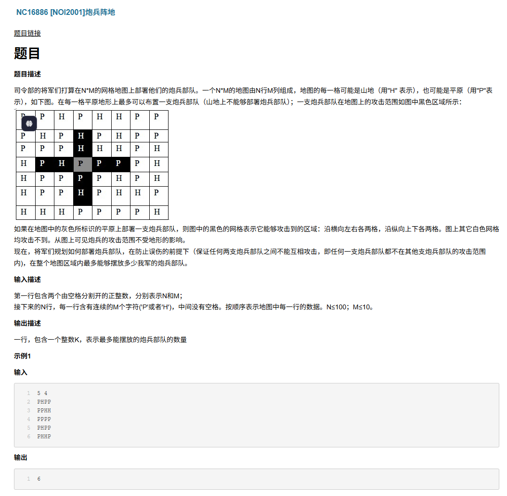

# 炮兵阵地



# idea 
首先这是一道经典状压题，由于MN 的不大，我们可以用状态压缩，一行一行的放炮兵，由于 不能攻击友军，所以我们要技能前两行的放法，因此 dp 从共需要3个维度，dp[i][st1][st2] 表示 第i 行怎么放可以拿到最多的炮兵，如果i - 1 行的状态是st1，i -2 行是st2

由于 每个炮兵可以攻击自己上两行和的地方，所以为了避免攻击友军，我们需要用两个状态表示第i-1，和i-2行的和法状态，然后与第i行的合法配合，那么进行状态转移的时候，我们要从i-1的放法继承过来，i-1行的所有合法放置方案都受到 i-2和i-3 行的约束，所以
dp[i][st1][st2] = max(dp[i - 1][st2][st3] + popcount(st1)); 当中s1 s2 s3 不重叠

# transition function

```
dp[i][st1][st2] = max(dp[i][st1][st2], dp[i - 1][st2][st3] + popcount(st1))
```

# solution
```C++
#include <bits/stdc++.h>
 
using namespace std;
 
int dt[107];
int dp[107][107][107];
vector<int> v, num;
 
int main() {
    std::ios::sync_with_stdio(0), cin.tie(0), cout.tie(0);
    int n, m;
    cin >> n >> m;
    for (int i = 2;i <= n + 1;i++) {
        for (int j = 1;j <= m;j++) {
            char ch;
            cin >> ch;
            if (ch == 'H') dt[i] |= 1 << (j - 1);
        }
    }
    for (int i = 0;i < (1 << m);i++) {
        if ((i & (i << 1)) || (i & (i << 2))) continue;
        v.push_back(i);
        num.push_back(__builtin_popcount(i));
    }
    int res = 0;
    for(int i = 2; i <= n; i+++){
        for(int j = 0; j < v.size(); j++){
            int st1 = v[j];
            if(st1 & dt[i]) continue;
            for(int k = 0; k < v.size(); k++){
                int st2 = v[k];
                if(st2 & dt[i - 1])continue;
                if(st2 & st1) continue;
                for(int l = 0; l < v.size(); l++){
                    int st3 = v[l];
                    if(st3 & dt[i - 2])continue;
                    if((st3 & st2) || (st3 & st1)) continue;
                    dp[i][j][k] = max(dp[i][j][k], dp[i - 1][k][l] + num[j]);
                }
                res = max(res, dp[i][j][k]);
            }
        }
    }
    cout << res << endl;
}

```